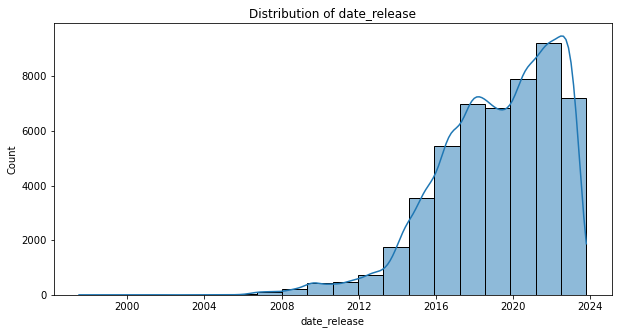
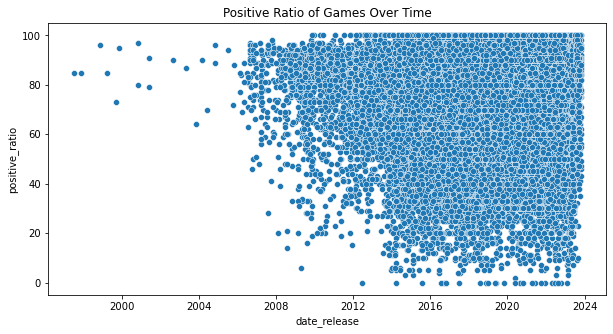
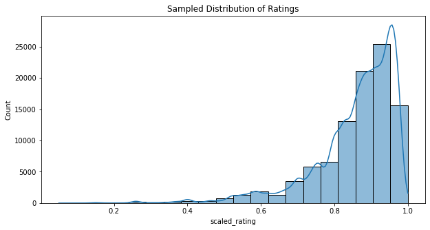
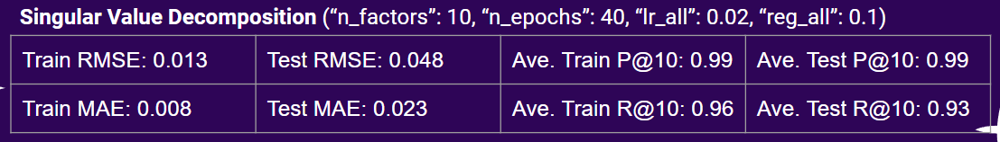

# Steam Game Recommender

Author: Brian Woo

## Business Problem

Steam aims to enhance user experience and increase engagement by providing personalized game recommendations to users. The goal is to help users discover new games they are likely to enjoy based on their existing preferences and behaviors. The Steam Game Recommender system seeks to predict user ratings for games using various game features. The dataset from Kaggle includes game titles, descriptions, tags, and user ratings, offering rich textual and numerical data to understand each game's characteristics and predict user preferences effectively.

Tasks:

- Analyze current gaming trends through ratings
- Create models that will predict what users will rate a game they don’t already own

## Data Understanding

Source: https://www.kaggle.com/datasets/antonkozyriev/game-recommendations-on-steam/data?select=recommendations.csv

Context:
The Steam games dataset is a dataset of ~ 50,000 games available and over 40 Million reviews on Steam. The dataset was collected from the Steam Official Store.

Content:

- games.csv - a table of games (or add-ons) information on ratings, pricing in US dollars $, release date, etc. A piece of extra non-tabular details on games, such as descriptions and tags, is in a metadata file;
- users.csv - a table of user profiles' public information: the number of purchased products and reviews published;
- recommendations.csv - a table of user reviews: whether the user recommends a product. The table represents a many-many relation between a game entity and a user entity.

## Data Preparation

1.Loading the Data:

    - Change data types to reduce memory usage:
    - float64 to float32
    - int64 to int32
    - object to category

2.Data Cleaning:

    - Assign proper data types to columns
    - Check for missing values and duplicates
    - Handle missing values appropriately
    - Check for outliers
    - Determine correlation matrices

3.Data Transformation:

    - Standardize and tokenize text data (e.g., game descriptions, tags)
    - Label encode categorical data (e.g., ratings, mac, win, linux)

4.Feature Extraction:

    - Use TF-IDF vectorization for text features
    - Scale positive ratio to a range of 0-1

Most of the games that were released were after 2010 and the majority of them were all ranked highly. Due to this information I filtered the data from 2010-Present day to get the most relevant games.

## Models

Note: In order to run my models I had to take a subset of the original data, or else I would run into memory errors.

This plot represents the sampled distribution of positive ratio. This is a decent representation of the original data as the curve is almost the same. This is important because it keeps the original nature of the dataset.

**Collaborative Filtering:**
Utilized the surprise library for its simplicity in model building and tuning. Implemented Baseline, SVD, and KNN models. For Baseline and SVD, performed a train-test split twice: once to sample the data and another to create train and test sets. For KNN, due to memory constraints, split the data three times, using the same initial splits as SVD and Baseline, followed by an additional split. Conducted a grid search to find the optimal hyperparameters for the SVD and KNN models. The Baseline model served as a benchmark for comparison. Model performance was evaluated using RMSE, MAE, Precision@k, and Recall@k.

**Content-Based Filtering:**
Used the sklearn library to build this model. Applied TF-IDF vectorization on combined textual features such as title, description, and tags. After splitting the data into train and test sets to assess overfitting or underfitting, vectorized the combined features using TfidfVectorizer from sklearn. Due to memory limitations, calculated cosine similarity in batches of 10. Evaluated the recommended games based on RMSE, MAE, Precision@k, and Recall@k.

## Conclusion

Best Model: **SVD Collaborative Filtering**

    - Best RMSE score
    - All other metrics also scored well
    - Was able to run models on the most number of rows (more variability)

## Next Steps

- Create a Hybrid Models / Explore other models
- Deploy and test on the web for real users
- Get more RAM!!
